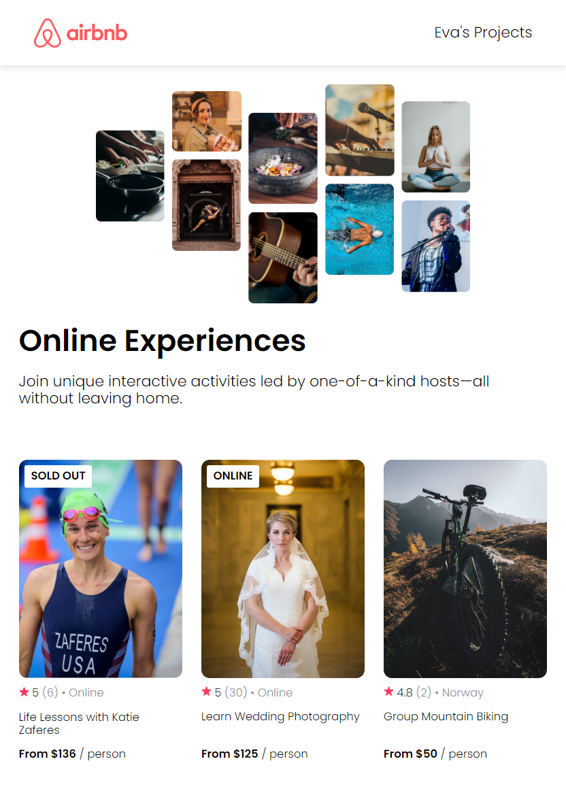

# Project Summary

## Application: A Captivating Airbnb Clone ##

Deploy: [Click Me](https://airbnb-clone-evas-projects.netlify.app/)

* This React project is a visually stunning and highly interactive clone of the popular Airbnb website.
* Designed to captivate users and provide an immersive experience. 
* With its sleek and modern styling, this project showcases the power of React in creating dynamic and responsive user interfaces.

## Application: Exploring Fun Facts with Style and Interactivity ##

Deploy: [Click Me](https://react-info-page-evas-projects.netlify.app/)

* This React project is a visually captivating and highly interactive showcase.
* That presents fun facts about React in an engaging and immersive manner. 
* With its sleek and modern styling, this project demonstrates the power of React in creating dynamic and responsive user interfaces, delivering an exceptional user experience.

